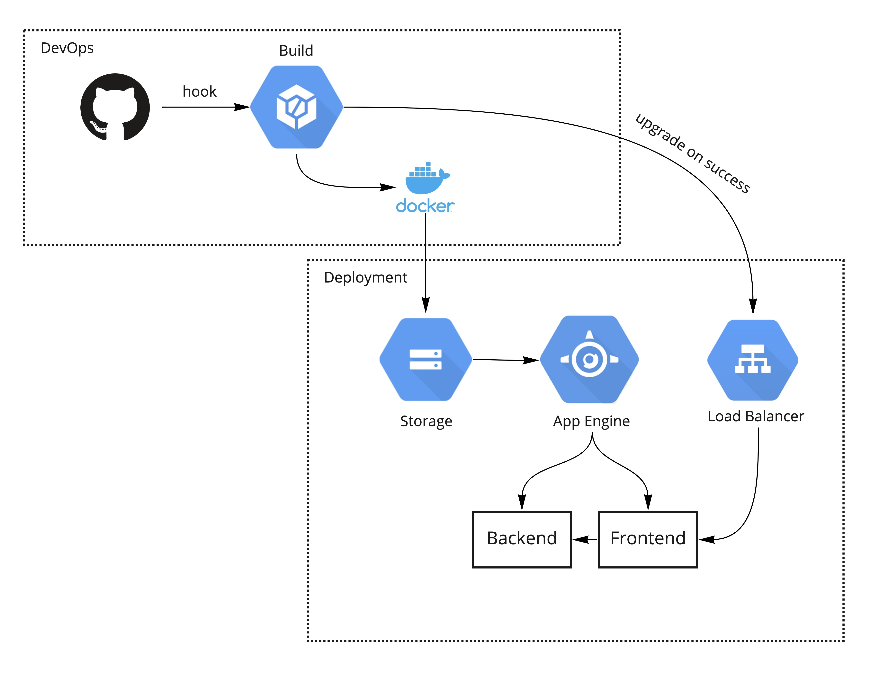

# Miljøhack 2021 - MiljøKråk①

Milhøhack er et årlig hackathon der Knwoit forsøker å løse moderne miljøutfordringer for selskaper.

Denne koden er laget som del av gruppe MiljøKråk① sitt bidrag til konkurransen.

Gruppen skal har akseptert utfordringen til Sparebank 1 som er følgende
> Hvordan kan Sparebank 1 hjelpe og motivere sine kunder til å kjøpe, bo og forvalte eiendommen sin mer klimavennlig, og hva vil det bety å bo mer bærekraftig i Norge?

## Arkitetkur
Applikasjonen ligger på App Engine i Google Cloud. Den ligger bak en last balanserer med Google Cloud Storage som artfaktlager. Fordi applikasjonen ligger i App Engine så vil den automatisk skalere opp og ned etter trafikk i last-balansereren, den kan til og med skalere ned til 0 når det er ingen trafikk.

Bygg gjøres via en plugin i Github som be Cloud Build om å igangsette byggprosess. Fra _main_ branchen så vil det også deployes artifacter til App Engine. Ved slutten av deployment så blir last balansereren fortalt at den skal bytte til ny stabil versjon.

Applikasjonen er også splittet i separat front- og backend der begge separat skaleres og last balanseres.

## Backend

[Backend repo](https://github.com/andreaseg/miljohack-team1-backend)

***

[Mer informasjon om Hackathon](https://www.hackathon.knowit.no/)

